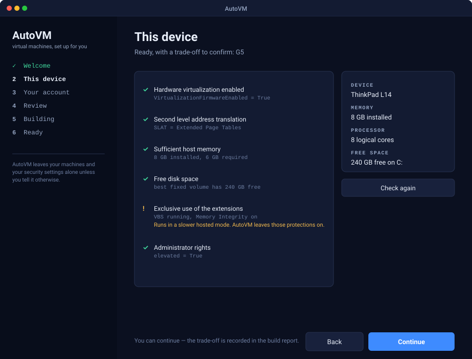
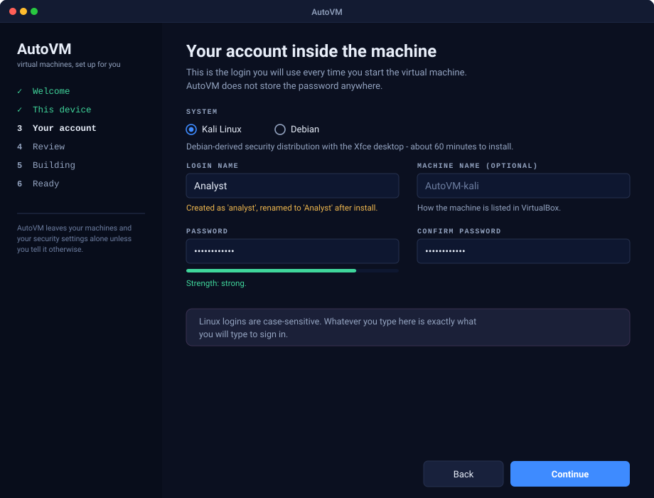
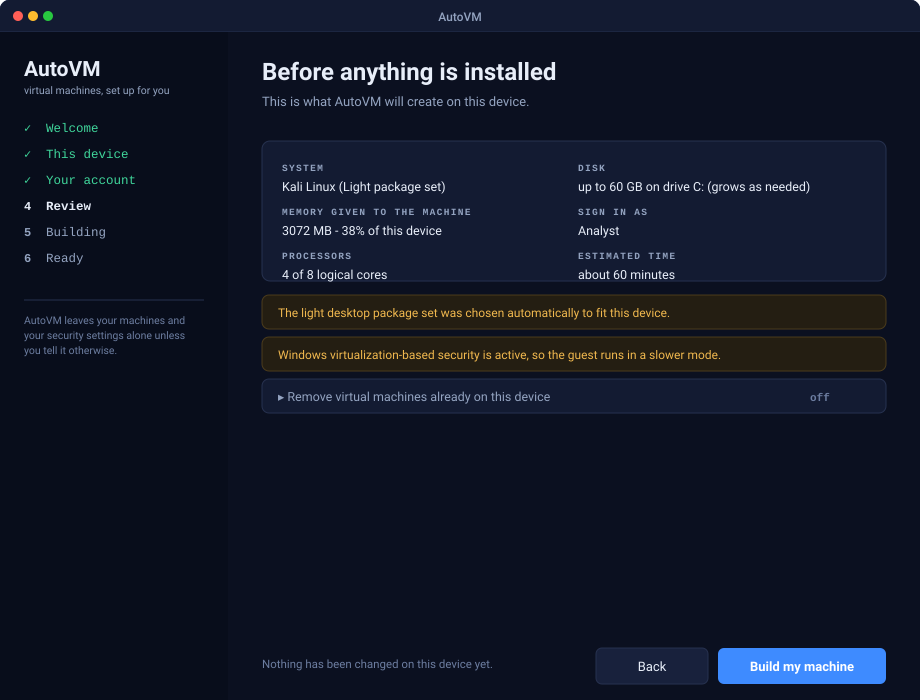
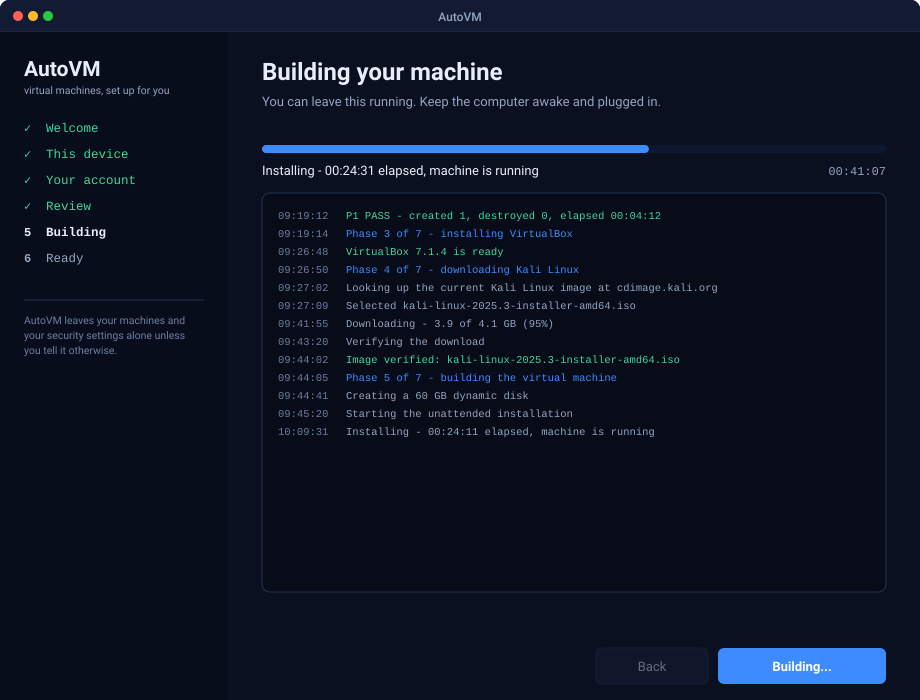
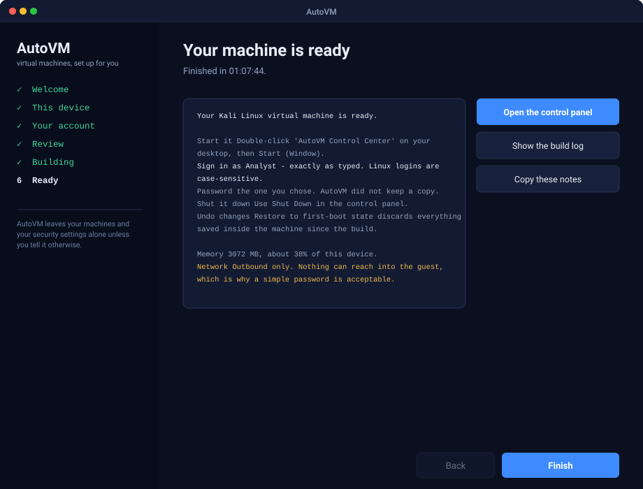
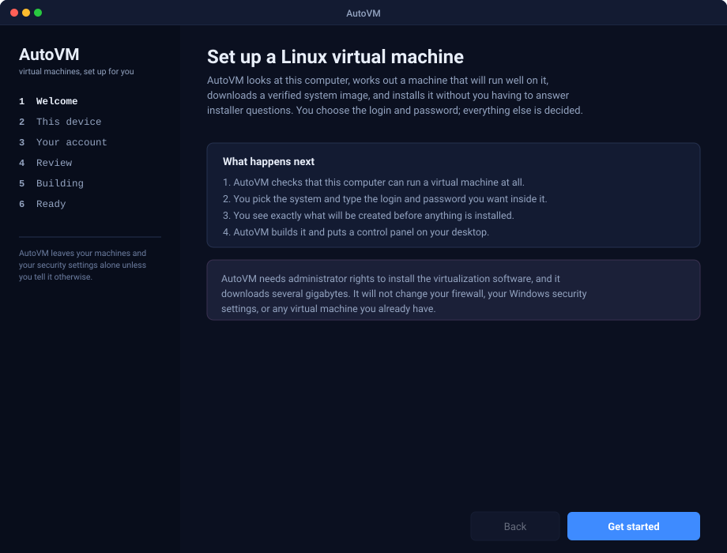

<div align="center">

<picture>
  <source media="(prefers-color-scheme: dark)" srcset="docs/assets/hero-dark.svg">
  <source media="(prefers-color-scheme: light)" srcset="docs/assets/hero-light.svg">
  
</picture>

<br>

<p>
  <a href="https://github.com/iofhouras/AutoVM/actions/workflows/build.yml"></a>
  <a href="tests/Invoke-Tests.ps1"></a>
  <a href="#what-you-need"></a>
  <a href="src/AutoVM"></a>
  <a href="LICENSE"></a>
</p>

<p>
  <b><a href="https://github.com/iofhouras/AutoVM/releases">Download</a></b>
  &nbsp;·&nbsp; <a href="#how-it-works">How it works</a>
  &nbsp;·&nbsp; <a href="#every-screen">See every screen</a>
  &nbsp;·&nbsp; <a href="#what-it-decides-for-you">What it decides for you</a>
  &nbsp;·&nbsp; <a href="#use-it-from-a-script">Use it from a script</a>
</p>

</div>

---

You install AutoVM, start it, and type the login and password you want inside your new Linux
machine. That is your whole job.

AutoVM does the rest: it measures the computer it is running on, sizes a guest that will actually
run well there, installs the hypervisor, downloads a system image and checks it against the
publisher's own checksum, drives the installation without asking you a single installer question,
proves the account works by signing into it, takes a restore point, and leaves a control panel on
your desktop.

## Get it

**1 · Download** — [`AutoVM-Setup-<version>.exe`][releases] from the latest release.

**2 · Install** — run it. It needs administrator rights, because virtualization software installs
a driver.

**3 · Start it** — from the Start menu. AutoVM checks the device, asks for a login and a password,
shows you exactly what it will build, and then builds it.

> [!NOTE]
> No release published yet? Every push also builds an installer — take it from the newest green run
> under [Actions][actions] → *Artifacts*.

### What you need

| | |
| :-- | :-- |
| **Windows** | 10 or 11, 64-bit |
| **Rights** | Administrator |
| **Memory** | 6 GB or more |
| **Disk** | ~45 GB free on any fixed volume |
| **Firmware** | Hardware virtualization (Intel VT-x / AMD-V) enabled |
| **Time** | 30–90 minutes, mostly unattended |

AutoVM checks every one of these on its second screen and tells you how to fix anything that is
missing — before it changes a thing.

## How it works

<picture>
  <source media="(prefers-color-scheme: dark)" srcset="docs/assets/flow-dark.svg">
  <source media="(prefers-color-scheme: light)" srcset="docs/assets/flow-light.svg">
  
</picture>

Six screens is what you see. Seven phases is what happens underneath, and each one has to *prove*
it worked before the next begins — the hypervisor by reporting its version, the image by matching
a checksum, the account by signing in, the restore point by appearing in the snapshot list. A
phase that cannot prove it stops the run and says so.

Every phase also records its outcome, so if you close the window, lose power, or Windows reboots
for an update, starting AutoVM again picks up where it stopped instead of doing it all over.

## Every screen

<details open>
<summary><b>2 · This device</b> — what AutoVM checks before it touches anything</summary>
<br>



Eight checks run in one pass, so you get the whole picture rather than the first problem it hit.
A red item blocks the build and comes with the fix. An amber item is a trade-off you decide —
AutoVM will never turn off Windows security features to make your guest faster.

</details>

<details>
<summary><b>3 · Your account</b> — the only thing you have to type</summary>
<br>



Type the login you want. **Including capitals** — which is harder than it looks: the Linux
installer only accepts lowercase account names and silently waits at a prompt when it gets one it
does not like. AutoVM creates the account in lowercase, renames it once it exists, moves the home
directory, fixes ownership, and then proves the result by signing in as the name you actually
asked for.

</details>

<details>
<summary><b>4 · Review</b> — everything before anything</summary>
<br>



Nothing on your computer has changed at this point. This screen is the last one where stopping
costs you nothing.

</details>

<details>
<summary><b>5 · Building</b> — leave it running</summary>
<br>



Long quiet stretches are normal: the package upgrade inside the installer is most of the wait.
The full log is written to `C:\ProgramData\AutoVM\logs` as it goes, and your password never
appears in it.

</details>

<details>
<summary><b>6 · Ready</b> — what you are left with</summary>
<br>



Plain language, no jargon: how to start it, exactly how to sign in, how to undo everything, and
the one security condition attached to your password.

</details>

<details>
<summary><b>1 · Welcome</b> — the first screen</summary>
<br>



</details>

## What it decides for you

<picture>
  <source media="(prefers-color-scheme: dark)" srcset="docs/assets/sizing-dark.svg">
  <source media="(prefers-color-scheme: light)" srcset="docs/assets/sizing-light.svg">
  
</picture>

Sizing is arithmetic over the device, not a fixed template:

| What | Rule |
| :-- | :-- |
| **Memory** | 40 % of the host, rounded down to a 512 MB step — never more than half, never above 8192 MB, never below what the guest needs |
| **Processors** | Half the logical cores, capped at 4 |
| **Disk** | The guest's preferred size, trimmed to fit the roomiest fixed volume with 15 GB left for Windows |
| **Where** | That volume — not blindly `C:` |
| **Packages** | Under 12 GB of memory gets the light desktop set and no audio device |

## What it will not do

<picture>
  <source media="(prefers-color-scheme: dark)" srcset="docs/assets/safety-dark.svg">
  <source media="(prefers-color-scheme: light)" srcset="docs/assets/safety-light.svg">
  
</picture>

> [!IMPORTANT]
> Your machine gets **outbound networking only**. Nothing on your network can reach into the
> guest, which is why a short password is acceptable inside it. If you ever switch the machine to
> bridged networking or forward a port into it, change the password first.

Removing virtual machines you already have is **off** unless you turn it on *and* type `DESTROY`.
Even then, WSL distribution disks, recovery images, `Windows.old` and any mounted disk are listed
as protected and kept.

## After the build

<table>
<tr>
<td width="52%" valign="top">


</td>
<td width="48%" valign="top">

<p>A shortcut lands on your desktop. From it you can:</p>
<ul>
  <li><b>Start</b> the machine in a window or headless</li>
  <li><b>Shut down</b> cleanly, or save its state</li>
  <li>Open <b>VirtualBox Manager</b> for anything advanced</li>
  <li><b>Restore to first-boot state</b> — back to the moment the build finished, discarding
      everything saved inside since</li>
</ul>
<p>The login is printed along the bottom, capitals and all, because that is the thing people
forget.</p>

</td>
</tr>
</table>

## Use it from a script

The wizard is one caller. The engine is a PowerShell module you can drive yourself.

```powershell
Import-Module 'C:\Program Files\AutoVM\AutoVM\AutoVM.psd1'

$password = Read-Host 'password' -AsSecureString

# See what this device would get. Changes nothing.
Invoke-AutoVMBuild -UserName analyst -Password $password -WhatIfPlanOnly

# Build it.
Invoke-AutoVMBuild -UserName analyst -Password $password -GuestId kali
```

Or the console front end, which prompts for the password and prints a summary:

```powershell
& 'C:\Program Files\AutoVM\AutoVM.Console.ps1' -UserName analyst -GuestId debian
```

<picture>
  <source media="(prefers-color-scheme: dark)" srcset="docs/assets/architecture-dark.svg">
  <source media="(prefers-color-scheme: light)" srcset="docs/assets/architecture-light.svg">
  
</picture>

## Systems you can build

| Id | System | Installs in | Package set |
| :-- | :-- | :-- | :-- |
| `kali` | Kali Linux | ~60 min | `kali-linux-core` + Xfce, or `kali-linux-default` |
| `debian` | Debian 13 | ~30 min | `task-xfce-desktop`, or `task-gnome-desktop` |

Both come from the publisher's own netinstall image over the publisher's own mirror. Adding
another is a JSON entry in [`guests.json`](src/AutoVM/Templates/guests.json) — no code change,
as long as it uses a Debian-style installer.

## When something goes wrong

<details>
<summary>Common stops, and what they mean</summary>
<br>

| What you see | What it means | What to do |
| :-- | :-- | :-- |
| "Hardware virtualization enabled" is red | VT-x / AMD-V is off in firmware | Reboot into BIOS/UEFI setup (often <kbd>F1</kbd>, <kbd>F2</kbd>, or the Novo button), enable it under Security, then choose **Check again** |
| "Free disk space" is red | No fixed volume has room | Free space, or let AutoVM use another drive — it picks the roomiest one automatically |
| VirtualBox fails to install | Device-management policy is blocking a kernel driver | AutoVM reports it rather than working around it. Ask whoever manages the device to allow Oracle VirtualBox |
| The build stops on a checksum | The download is corrupt or was tampered with | AutoVM deletes it and stops. Run it again; a second failure means the mirror is the problem |
| The install seems stuck | Usually the package upgrade, which is quiet for 20–30 minutes | Let it run. If it hits the deadline, AutoVM captures a picture of what the machine is showing |
| "Login incorrect" in the guest | Linux logins are case-sensitive | Type the login exactly as you entered it — including capitals |

Every run writes a full log to `C:\ProgramData\AutoVM\logs`, and the final screen names the step
that stopped. Starting AutoVM again continues from the last completed step.

</details>

## Build it yourself

```powershell
./build/Build-Installer.ps1 -Version 1.0.0    # -> dist/AutoVM-Setup-1.0.0.exe
./build/Build-Installer.ps1 -SkipInstaller    # -> dist/staging, a runnable copy
./tests/Invoke-Tests.ps1                      # 65 tests, Windows or Linux
```

The installer needs [Inno Setup 6][inno] on Windows. The tests need nothing at all.

<details>
<summary>Repository layout</summary>
<br>

```
src/AutoVM/            the engine — PowerShell module, seven phases, pure planning logic
src/AutoVM.App/        the wizard — WPF window and its host script, plus a console front end
src/AutoVM.Launcher/   a small C# executable so the app has an icon and one elevation prompt
build/                 launcher compilation and the Inno Setup installer definition
tests/                 dependency-free test suite
docs/agent-directive/  the 50-page design document this implementation follows
docs/assets/           the artwork on this page, and the script that generates it
```

</details>

## Where it stands

| | |
| :-- | :-- |
| Engine tests | **65 passing** — sizing, gates, credentials, answer-file generation, deletion safety, secret redaction, the resume ledger |
| Script and window parsing | Every `.ps1` / `.psm1` / `.psd1` and the XAML, in CI |
| Module load | PowerShell 7 on Linux, Windows PowerShell 5.1 on Windows, in CI |
| Installer build | Compiled and uploaded on `windows-latest`, every push |
| **End-to-end build on real hardware** | **Not yet run** |

> [!WARNING]
> The parts that cannot be unit-tested — the VirtualBox calls, the unattended install, the desktop
> shortcut — are written against [the design document](docs/agent-directive/) but have not been
> executed against a live Windows host from this repository. Treat your first run as the smoke
> test, and send us `C:\ProgramData\AutoVM\logs` if it stops.

## Documentation

- **[Agent Directive rev 2.0](docs/agent-directive/KaliVMAgentDirective-v2.pdf)** — the 50-page
  design document behind the engine: phases, gates, failure playbook, and the reasoning behind
  each decision.
- **[Application architecture](docs/APPLICATION.md)** — how the wizard, the engine and the
  installer fit together, and how to add a guest.
- **[End-user notes](docs/INSTALL.txt)** — what ships as the installed README.

## Licence

[MIT](LICENSE). AutoVM installs and drives third-party software under its own terms — VirtualBox
is GPLv3, and guest images are downloaded from their publishers rather than redistributed here.

[releases]: https://github.com/iofhouras/AutoVM/releases
[actions]: https://github.com/iofhouras/AutoVM/actions
[inno]: https://jrsoftware.org/isinfo.php
